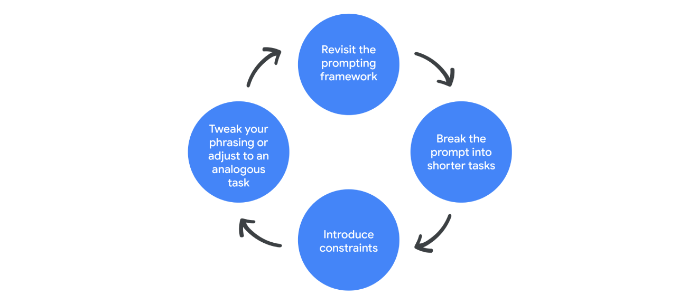

### Google promting essential

I take this course to improve my prompting skill for my every day JOB

## 5-step prompt framework

a good promt follow a simple framework(maybe?)

TCREI (Tecrei en español)

T = Task (Tarea, Accion, Objetivo)
C = Context (Contexto)
R = References (Referencia)
E = Evaluate (Evaluar)
I = Iterate (Iterar, Repetir)

First is task.
You need to describe the task you want the generative AI
tool to help you with.
Now, this should include a persona
and a format preference, so that the task is specific.
Persona refers to
what expertise you want the gen AI tool to draw from.
You can ask the tool to take on a persona like a
professional speech writer
or a marketing executive with 15 years of experience.
Or you can ask it to create output for a specific audience,
a customer, or even your manager.
You can be as detailed as you'd like when adding a persona
to your task. Format refers to how you want the output
to appear, whether that's a bulleted list,
short sentences, or a table.
So there you have it task.
Next, you'll include context
or the necessary details to help the gen AI tool understand
what you need from it.
This is the difference between writing.
Give me some ideas for a birthday present under $30
and give me five ideas for a birthday present.
My budget is $30.
The gift is for a 29-year-old who loves winter sports
and has recently switched from snowboarding to skiing.
Sometimes you'll add references for the gen AI tool
to use while creating its output.
You just asked a gen AI tool to give you ideas
for a birthday present, right?
Well, if you add examples
of birthday presents you've given in the past as references,
the gen AI tool can give you a more useful output.
There aren't always going to be clear references of
what you need, especially if you're working on something
more abstract or searching for ideas and inspiration.
Once you have your output, it's time to evaluate.
Ask yourself if the input you
provided gave you the output you needed.
This leads us to the final part of the framework. Iterate.
If you evaluate your output
and determine that you're not getting what you need,
you can try again by adding more information
or tweaking your prompt.
And this is a key part of prompting effectively,
and we'll explore it in depth later on in the course.
One more note on the framework.
There are plenty of ways to construct an effective prompt.
The order of how you construct a prompt is less important
than this substance of the prompt itself.
As long as you're thoughtfully creating, really, excellent
inputs, your outputs should be great. 


Prompt example:

``` bad idea of prompt
Give me some ideas for a birthday present under $30.
```

``` God idea of prompt
Give me 5 ideas for a birthday present. My budget is $30. The gift is for a 29-years-old who loves winter sports and has recently swithced from snowboarding to skiing.
```


- **Task**: es la tarea que va realizar la IA y se dividie en dos:
    - Persona: here you will let the AI take a person rol (ex, be a techer or be developer or be shopping buddy or a normal person) 
    - Format: is goint to be the output, to who is this concent that you are creating for, ex maybe a manager, older people, maybe a json or yaml file for a program.
- **Context**: give the details of what is need, more detail seems to be better (but I have to try on that, when more is enough?)
- **References**: for the example of the gift present.. tyou can add refrences from previus gifts, so it knows more about you and also the present doesn't repeat.
- **Evaluate**: Evaluate first by reading the prompt an check if all that is there is need to complete the task, or if you need to add something else.
Second if you run the prompt and the answer is not what you expecet... Well that is why the *Iterate* step comes handy.
- **Iterate**: if the otput is not what expected or need more information or less, you re-evaluate your prompt and rewirte to make it run as you need it.


And if the prompt is good and fill all your needs save it, as future refrences

TCREI: 
- tarea
- contexto
- referencia
- evaluar
- iterar


---

To iterate most effectively, prompt your AI tool in the same chat. That way, the tool can reference information you've provided it with in previous prompts and build on that knowledge. 

Here’s how iteration works in action. Consider this example prompt: 

Identify the latest developments in the restaurant industry.

It’s a simple prompt that only includes the task, and it might generate some broad insights, but chances are that you’ll need to iterate in order to get an output closer to what you want. You can try these four iteration methods to generate more useful outputs:

    Revisit the prompting framework: Make sure your prompt is clear about your desired task and includes a specific persona and format, plenty of context, and offers relevant references that help inform the output. Here’s an example: 

    Create a bulleted list including the latest developments in the restaurant industry specific to urban areas that could impact the public reception of a dining experience using only ingredients native to the region. 

    Break the prompt into shorter sentences: Instead of packing everything into a complex and lengthy prompt, address each individual step in a separate prompt until you’ve accomplished everything:

    Prompt one: Create a bulleted list including the latest developments in the restaurant industry.

    Prompt two: Summarize the trends that would specifically impact restaurants in urban areas.

    Prompt three: Write a pros and cons list on how those developments could impact the public reception of a dining experience using only ingredients native to the region.

    Tweak your phrasing or switch to an analogous task: Shift your language to explain what you mean in a different way. Or, try a different task that’s similar to what you’re trying to complete but different enough to trigger a new response. Here’s an example:

    I’m starting a restaurant that will only include produce from within 50 miles. You’re a diner that lives in a major city and keeps up with the latest restaurant trends. Write a list of questions that I should consider before opening up the restaurant.

    Introduce constraints: Focus the gen AI tool’s output by adding constraints, or limitations, to your prompt. When you set boundaries for specific categories, lengths, formats, or other details in your prompt, you help the tool provide a more precise output. It’s like asking for a list of food recipes but specifying that the recipe should only use seasonal ingredients and take less than 30 minutes to prepare. Adding constraints can actually encourage more inventive, targeted results that better match your needs. Here’s an example:
    

    Create a bulleted list including the latest developments in the restaurant industry specific to urban areas that could impact the public reception of a dining experience using only ingredients native to the region. This list should only include trends from cities with a population of more than 500,000 people, and should only include trends relevant to vegetarian and vegan restaurants.

Four iteration methods: revisit framework, shorten prompt, add constraints, and tweak phrasing or switch to analogous task.



When providing guidance to a gen AI tool, it’s important to know the right direction to point it in. Whether you’re adhering more closely to the prompting framework, dividing a longer prompt into a few shorter ones, applying constraints, or re-phrasing your prompt as a similar task, iteration is the key to troubleshooting your prompt design and targeting the output you need.